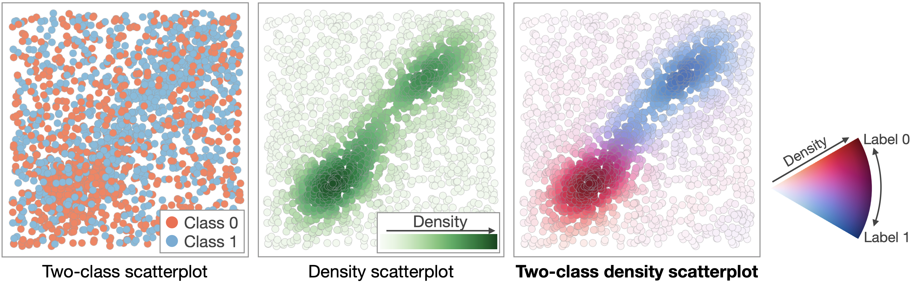

# Two-class density scatterplot

About
-----
* Python implementation of the two-class density scatterplot, which is introduced in the paper below:
  
  * Lu et al., "Visual Analytics of Multivariate Networks with Representation Learning and Composite Variable Construction." arXiv.xxxx.

* As shown in the above example, the two-class density scatterplot allows us to see the density and class distribution at the same time.

Requirements
-----
* Python 3
* Tested on MacOS 13.1 (Ventura)

Installation
-----

In the terminal, move to this repository's directoy and run:

  `pip3 install .`

Usage
-----
* Documentations (args, etc.) can be found in "two_class_density_scatterplot.py".

* For the usage examples, see the notebook, 'sample.ipynb' or the part after `if __name__ == '__main__':` in  'two_class_density_scatterplot.py'

  * Examples in "two_class_density_scatterplot.py" can be produced with:
  
     `python3 two_class_density_scatterplot.py`

